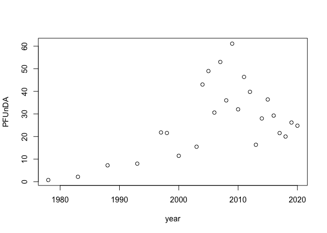
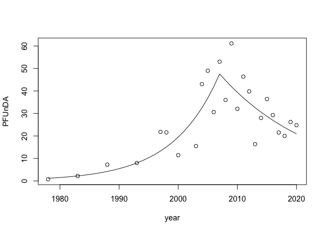

# lmcp

This is a simple package to fit a change-point model involving a change
in trend, while ensuring a continuous curve.

## Installation

Install using

``` r
devtools::install_github("https://github.com/mskoldSU/lmcp")
```

## Example: PFUnDA in Guillemot eggs

PFUnDA (Perfluoroundecanoic acid) is a persistant organic pollutant,
also known as a “forever chemical”. The time-series `pfunda_uria`
contains concentrations of PFUnDA measured in Guillemot eggs.

``` r
library(lmcp)
plot(pfunda_uria)
```

<!-- -->

To model the introduction of the chemical in the environment, followed
by it being phased out, we may consider a continuous curve changing from
an upward to a downward trend at a change point. The function `lm_cp` is
a wrapper for fitting such a curve using `lm` and a one-dimensional
B-spline with a single knot at the change-point, where the change-point
is chosen as the value that minimises the residual sum of squares. The
`lm` summary output is also augmented with information on the trend
before and after the change-point.

A log-linear model is fitted by

``` r
fit <- lm_cp(log(PFUnDA) ~ year, data = pfunda_uria)
summary(fit)
```

    ## 
    ## Call:
    ## lm_cp(formula = log(PFUnDA) ~ year, data = pfunda_uria)
    ## 
    ## Residuals:
    ##      Min       1Q   Median       3Q      Max 
    ## -0.68889 -0.20599  0.08208  0.23700  0.54130 
    ## 
    ## Coefficients:
    ##                                     Estimate Std. Error t value Pr(>|t|)    
    ## (Intercept)                           0.1668     0.2282   0.731    0.473    
    ## bs(year, degree = 1, knots = 2007)1   3.6954     0.2914  12.681 1.37e-11 ***
    ## bs(year, degree = 1, knots = 2007)2   2.8754     0.2701  10.647 3.81e-10 ***
    ## ---
    ## Signif. codes:  0 '***' 0.001 '**' 0.01 '*' 0.05 '.' 0.1 ' ' 1
    ## 
    ## Residual standard error: 0.353 on 22 degrees of freedom
    ## Multiple R-squared:  0.8865, Adjusted R-squared:  0.8762 
    ## F-statistic: 85.89 on 2 and 22 DF,  p-value: 4.038e-11
    ## 
    ## 
    ## Optimal change-point found at year=2007, with coefficients: 
    ##          Estimate Std. Error t value  Pr(>|t|)    
    ## Trend 1  0.127429   0.010048 12.6814 1.367e-11 ***
    ## Trend 2 -0.063083   0.018418 -3.4251  0.002422 ** 
    ## ---
    ## Signif. codes:  0 '***' 0.001 '**' 0.01 '*' 0.05 '.' 0.1 ' ' 1

where the top part of the summary comes from the fit
`lm(log(PFUnDA) ~ bs(year, degree = 1, knots = 2007), data = pfunda_uria)`
and the bottom part translates fitted coefficients to estimates of trend
before and after the change-point. Note that $p$-values should be
interpreted conditionally on the fitted change-point.

We may illustrate the fitted function using `predict` on the `lm` part
of the object

``` r
fitted <- exp(predict(fit, newdata = data.frame(year = 1978:2020)))
plot(pfunda_uria)
lines(1978:2020, fitted)
```

<!-- -->

The package also contains a function `cp_test` that approximate a
p-value for the null-hypothesis of no change-point using parametric
Bootstrap. Here run with default 1000 iterations, but larger values
should be considered.

``` r
cp_test(fit)
```

    ## Approximate P-value based on 1000 Monte-Carlo iterations:

    ## [1] 0.003
